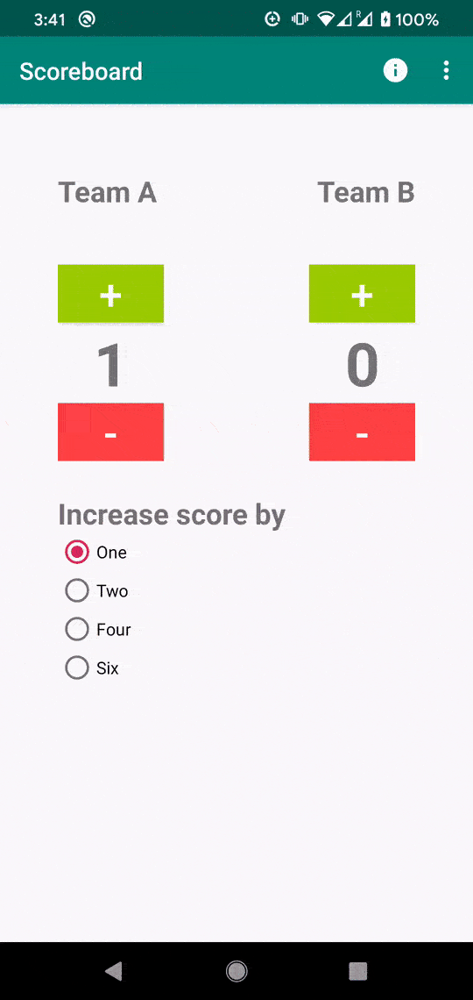

# Scoreboard

Cambrian lab

## Demo

## Review - 03/05/2020

### Code review with Faisal

- I have used a ScrollView to make it easy for small screens and different device orientation. So when user uses the app on a smaller screen Or turn his device into landscape, all the components are still accessible by scrolling down / up. Without a ScrollView, it could be hard or impossible to use in smaller screens or landscape orientation.

- He has used local variables for everything, where in I'm taking the values from the controls at runtime. Due to which his code could run slightly faster at run time but it ends up taking lot of memory. Where in mine could take very less memory, but excution could be slightly slower.

- He has images for each team where in I have used simple Text. Using images are fancy but given the scope is going to change every week as we work on this project, I wanted to keep things simple as possible so it's easy to modify as new requirements are pushed in.

- He has used check change event to keep the values locally in a variable, I do pick it up upon button click itself. So the app could use less memory at runtime.

- Overall he has focused on reusing the code, I have focused on least code as possible so it is easy for me to adopt new changes as they come in.
